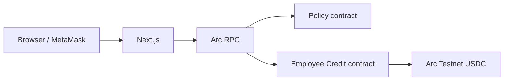

# Within

Freedom without friction. Control within.

## Overview

Within is a programmable company-spending workspace built on Arc Testnet.

It combines:

- programmable spending rules
- human approval workflows
- connected Arc wallets
- automatically approved employee credit
- onchain USDC funding, borrowing and repayment

## Product principle

AI proposes.

Humans approve.

Arc executes.

## Live application

**Public URL:** _Add the production URL after deployment._

## Demo video

**Public video:** _Add the public video URL before submission._

## Built on Arc

Within records spending-rule activation on Arc Testnet. Employee Credit pool
funding, credit drawdown and repayment use testnet USDC, with confirmed
transaction evidence linked through ArcScan.

## Contracts

| Contract | Arc Testnet address | ArcScan |
| --- | --- | --- |
| Policy | `0x0C2cde1a2438d6A0fED4b58Bd1461F60EAbD32BB` | [View policy contract](https://testnet.arcscan.app/address/0x0C2cde1a2438d6A0fED4b58Bd1461F60EAbD32BB) |
| Employee Credit | `0x20420A38876AC38aEf2d78969E8bD1572fB37794` | [View Employee Credit contract](https://testnet.arcscan.app/address/0x20420A38876AC38aEf2d78969E8bD1572fB37794) |
| Arc Testnet USDC | `0x3600000000000000000000000000000000000000` | [View USDC](https://testnet.arcscan.app/address/0x3600000000000000000000000000000000000000) |

## Architecture



The browser keeps wallet connection state in memory and uses the selected
EIP-1193 provider only for explicit wallet actions. Public contract reads use
the Arc Testnet RPC. Transaction completion is based on confirmed receipts and
contract state, not locally fabricated evidence.

## Local development

Requirements:

- Node.js 22 or newer
- Foundry for contract development
- MetaMask for explicit Arc Testnet wallet actions

```bash
npm ci
cp .env.example .env.local
npm run dev
```

Open [http://localhost:3000](http://localhost:3000).

Useful commands:

```bash
npm run lint
npm run build
npm test
npm run start
cd contracts && forge test --offline
```

Local environment files are ignored. Never place private keys, mnemonics,
access tokens or server secrets in `NEXT_PUBLIC_*` variables.

## Test results

Latest verified local run:

- Frontend: **130 passed, 0 failed**
- Contracts: **62 passed, 0 failed** using `forge test --offline`
- ESLint: passed
- Next.js production build: passed

The installed Foundry binary currently panics on macOS while initializing its
external signature service for plain `forge test`; offline execution completes
all contract suites successfully.

## Testnet notice

Within currently runs on Arc Testnet. Testnet assets have no real-world value.

Within does not claim to be audited, regulated, production-ready or officially
endorsed by Arc or Circle.
